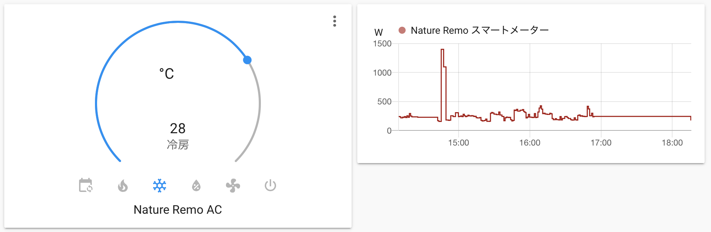
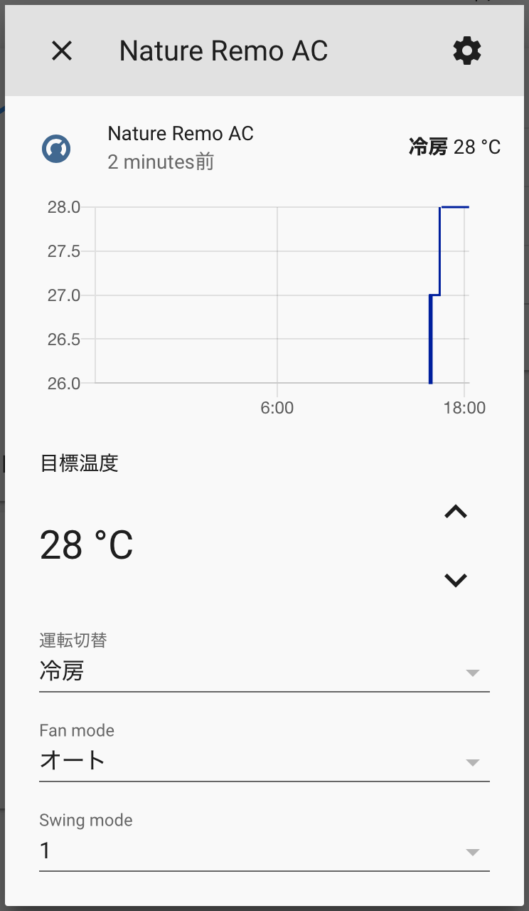

# Home Assistant integration for Nature Remo

Yet another [Home Assistant](https://www.home-assistant.io) component for [Nature Remo](https://en.nature.global/en/).

⚠️This integration is neither Nature Remo official nor Home Assistant official. **Use at your own risk.** ⚠️



## Supported features

- [x] Air Conditionar
  - [x] Set mode (e.g. cool, warm, blow etc.)
  - [x] Set temperature
  - [x] Set fan mode
  - [x] Set swing mode
  - [x] Show current temperature
  - [x] Remember previous target temperatures when switching modes back and forth
- [x] Energy Sensor (Nature Remo E/E Lite)
  - [x] Fetch current power usage
- [ ] Switch
- [ ] Light
- [ ] TV
- [ ] Others
  - [ ] Fetch sensor data

Tested on Home Assistant Core 2021.3.3 on Docker

## Installation

### Manual Install

1. Download this repository
1. Create `custom_components/nature_remo` folder at your config directory
1. Copy files into it (Just drag&drop whole files would be fine)

```
{path_to_your_config}
├── configuration.yaml
└── custom_components
    └── nature_remo
        ├── __init__.py
        ├── climate.py
        ├── manifest.json
        └── sensor.py
```

### Install via git submodule

If you have set up git, you can also install this component by adding submodule to your git repository.

```sh
git submodule add https://github.com/yutoyazaki/hass-nature-remo.git {path_to_custom_component}/nature_remo
```

## Configuration

1. Go to https://home.nature.global and sign in/up
1. Generate access token
1. Add following codes to your `configuration.yaml` file

```yaml
nature_remo:
  access_token: YOUR_ACCESS_TOKEN
```
